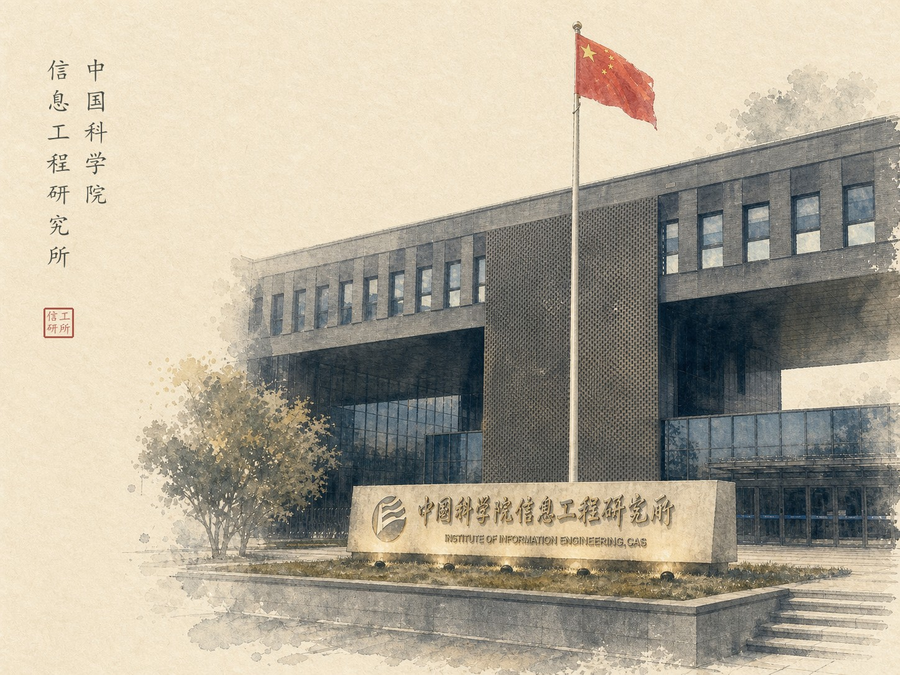
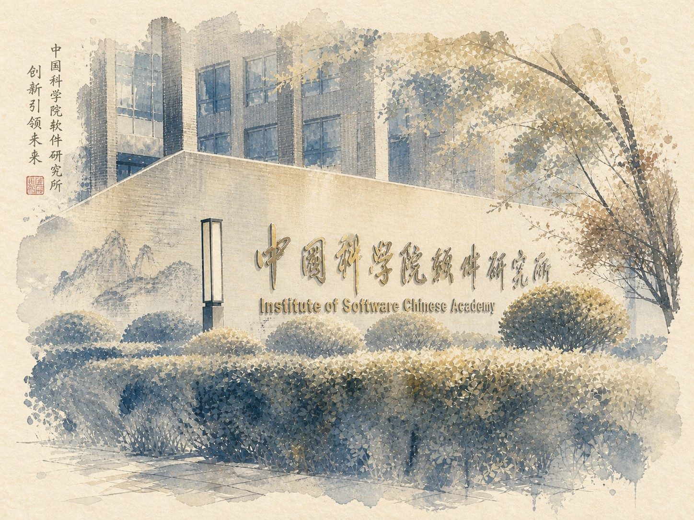
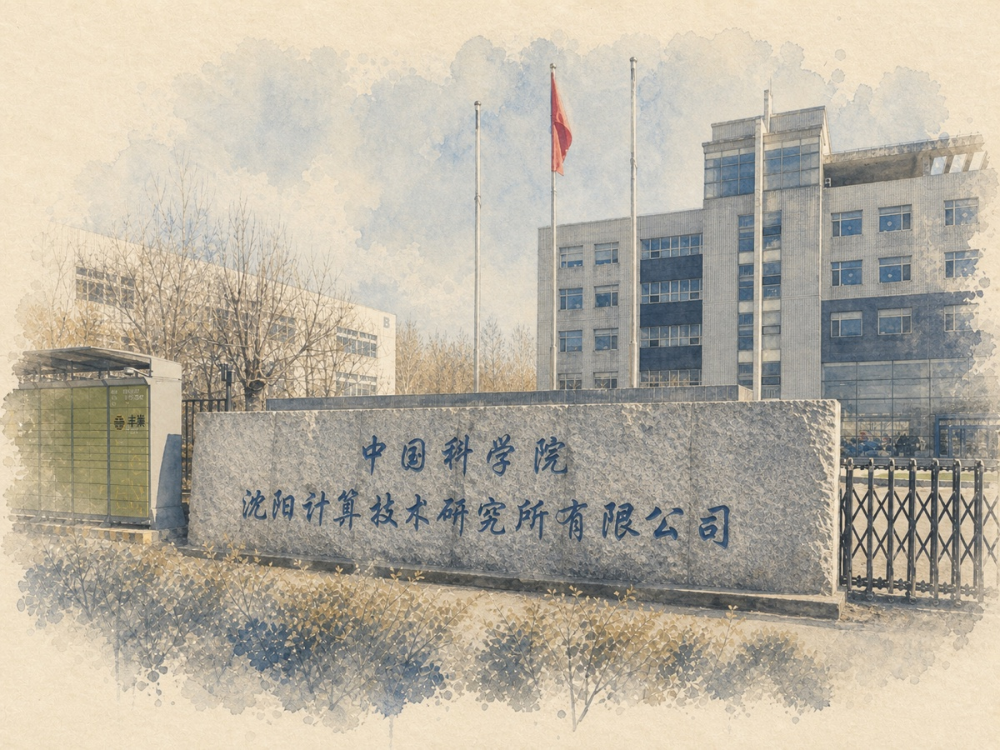

## 信工所

[中科院信息工程研究所](https://iie.cskaoyan.cn/)

信息工程研究所国科大计算机考研相关信息整理，包括招生目录、参考资料与经验信息。

## 软件所

[中国科学院软件研究所](https://iscas.cskaoyan.cn/)

软件所考研报考指南，含初试、复试与上岸经验。

## 沈计所

[中国科学院沈阳计算技术研究所报考指南](https://sict.cskaoyan.cn/)

沈阳计算所国科大计算机考研相关信息整理，包括报考指南、历年数据、经验归档与交流信息。

## 华大

[中国科学院人工智能学院华大联培](https://ucas-bgi.cskaoyan.cn/)

国科大人工智能学院人工智能专业华大联培报考指南，内容由学生整理，非官方信息。

## 杭高院

[中国科学院杭州高等研究院](https://hias.cskaoyan.cn/)

国科大杭州高等研究院（杭高院）报考与学习指南，由考生志愿维护的非官方公益站点，旨在为报考杭高院的同学提供从报考、复试到培养生活的全面参考。
